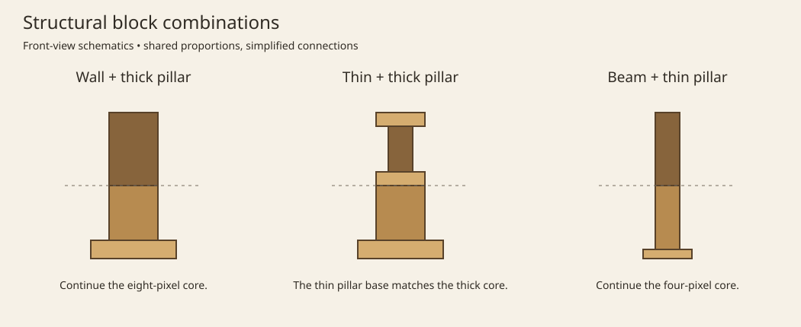

# Wooden Accents Mod

Vanilla-scale furniture and structural accents for every wood type.

[Modrinth](https://modrinth.com/mod/wooden-accents-mod) · [CurseForge](https://www.curseforge.com/minecraft/mc-mods/wooden-accents-mod) · [Report a bug](https://github.com/Mystery2099/WoodenAccentsMod/issues) · [Changelog](https://github.com/Mystery2099/WoodenAccentsMod/blob/master/CHANGELOG.md)

## About

Wooden Accents adds wooden furniture, storage, and building blocks for Minecraft 1.21.1 on Fabric and NeoForge. I want the pieces to be simple, useful where it makes sense, and easy to work into your own builds.

## Building with Wooden Accents

The idea is to give you more things to build with, without deciding how you should use them. Some decorations have a function, like sitting in chairs or storing items in cabinets. Others are just pieces to build with.

Walls, pillars, fences, and support beams are designed to work together. Their sizes are intentional: thick pillar cores line up with wall posts, and thin pillar bases have the same width as those posts. Thin pillar cores match the width of fence posts and support beams.

The connections work across block types, too. You can continue a thin pillar vertically into a fence or support beam, or put a wall or thin pillar above a thick pillar. Try mixing them in your builds. You don't have to stick to one type of block for a whole column or railing.

Block tags define many of these connections, so data packs can change which blocks are compatible. The neighboring block's shape also matters.

*Simplified front views showing how the widths line up.*

## Features

### Furniture

- Chairs you can sit in
- Tables, desks, kitchen counters, and cabinets
- Coffee tables that stack into a taller version; Silk Touch keeps the tall variant when you pick it up
- Narrow bookshelves based on vanilla chiseled bookshelves

### Storage

- Nine-slot crates that keep their contents when broken and stack up to four as items
- Desk drawers and kitchen cabinets with 27 slots; both drop their stored contents when broken
- Bracket shelves that display three item stacks and swap hotbar loadouts when powered

### Building blocks

- Connecting stripped-wood ladders
- Plank ladders
- Plank flooring and walls
- Picket fences and fence gates
- Support beams that connect in all six directions
- Thin and thick pillars that connect vertically

Every block has a variant for each vanilla wood type in 1.21.1, including bamboo, cherry, crimson, and warped wood.

## Using the blocks

The creative tabs group blocks into Furniture, Storage, and Building. Each block type has its wood variants together.

- Use a chair to sit and sneak to dismount. Each chair seats one player. Breaking an occupied chair dismounts its rider.
- Crates keep their nine slots of items when broken. Crates with identical item data can stack up to four. Crates reject items in the mod's `unnestable` tag, including other crates and shulker boxes.
- Name a crate, desk drawer, or kitchen cabinet in an anvil before placing it. The container uses that name, and its dropped block item keeps it. Drawers and cabinets scatter their contents separately when broken.
- Place a matching coffee table on top of a short one to make it tall. Silk Touch keeps the tall version; breaking it normally drops two short tables.
- Attach bracket shelves to solid block faces. Use the left, middle, or right third to swap that slot with your held stack. Power up to three connected shelves facing the same way to swap their contents with the rightmost three, six, or nine hotbar slots. Hoppers insert from above and extract below.

Picket fences, plank flooring, and narrow bookshelves previously had names based on "modern fences," "plank carpets," and "bookshelves." Their block and item IDs are unchanged, so existing worlds and recipes keep working.

## Gallery

*Picket fences and fence gates*

*Narrow bookshelves*

*Bamboo and cherry chairs*

*Bamboo and cherry crates*

*Bamboo and cherry picket fences and fence gates*

## Compatibility

| | |
|---|---|
| Minecraft | 1.21.1 |
| Loader | Fabric or NeoForge (client and server) |
| Java | 21 or newer |

## Dependencies

**Required**

- [VoxLib 1.8.0+1.21.1](https://modrinth.com/mod/voxlib) for your loader
- Fabric: [Fabric Loader 0.19.5 or newer](https://fabricmc.net/use/installer/), [Fabric API 0.116.17+1.21.1 or newer](https://modrinth.com/mod/fabric-api), and [Fabric Language Kotlin 1.14.1+kotlin.2.4.20 or newer](https://modrinth.com/mod/fabric-language-kotlin)
- NeoForge: [NeoForge 21.1.251 or newer](https://neoforged.net/) and [Kotlin for Forge 5.12.0 or newer](https://modrinth.com/mod/kotlin-for-forge)

**Optional / recommended**

- [Shulker Box Tooltip 5.1.9+1.21.1 or newer](https://modrinth.com/mod/shulkerboxtooltip) or [Easy Shulker Boxes](https://modrinth.com/mod/easy-shulker-boxes) for crate inventory previews
- [Just Enough Items](https://modrinth.com/mod/jei) or [Roughly Enough Items](https://modrinth.com/mod/rei) for recipes

## Installation

1. Install Fabric Loader or NeoForge for Minecraft 1.21.1.
2. Install the required dependencies above (Modrinth usually pulls them in for you).
3. Download Wooden Accents from Modrinth, CurseForge, or [GitHub Releases](https://github.com/Mystery2099/WoodenAccentsMod/releases).
4. Put the mod JARs in your Minecraft `mods` folder.

If Minecraft reports a missing or incompatible dependency, use the version named in that error. Do not mix builds made for different Minecraft versions.

## FAQ

**Can I use this in a modpack?** Yes. Credit and a link back are appreciated.

**Where are the recipes?** In JEI or REI, same as any other mod.

## Development

For build instructions and help contributing, see [CONTRIBUTING.md](https://github.com/Mystery2099/WoodenAccentsMod/blob/master/CONTRIBUTING.md).

## License

Wooden Accents is available under the [Minecraft Mod Public License 1.0.1](https://github.com/Mystery2099/WoodenAccentsMod/blob/master/LICENSE).

## Support

The mod is free. If you'd like to support my work, you can [buy me a coffee](https://buymeacoffee.com/mystery2099).
