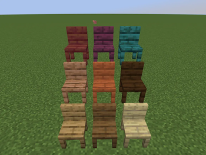
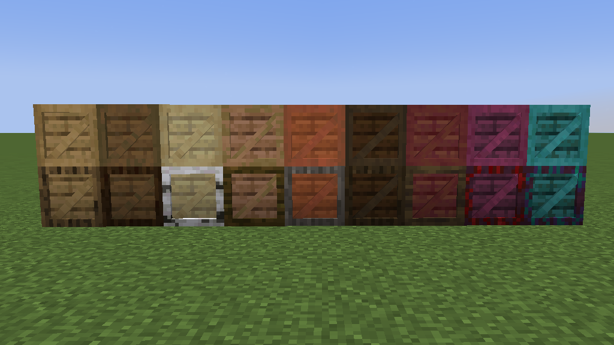
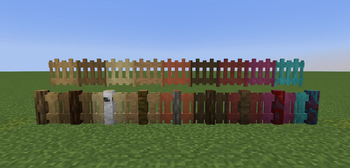
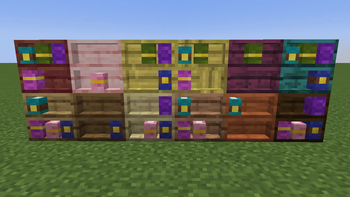
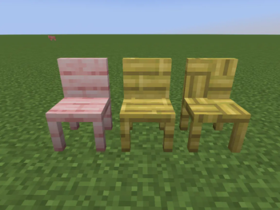
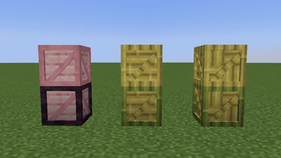
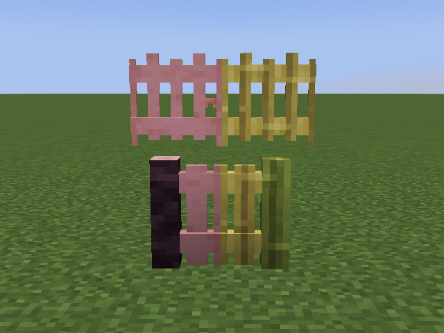

# Wooden Accents

Vanilla-scale furniture and structural accents for every wood type.

[Modrinth](https://modrinth.com/mod/wooden-accents-mod) · [CurseForge](https://www.curseforge.com/minecraft/mc-mods/wooden-accents-mod) · [Report a bug](https://github.com/Mystery2099/WoodenAccentsMod/issues) · [Changelog](https://github.com/Mystery2099/WoodenAccentsMod/blob/master/CHANGELOG.md)

## About

I like building with vanilla blocks, but sometimes a chair should look like a chair and a support beam should not need three layers of trapdoors. Wooden Accents adds furniture, storage, and structural details for Minecraft 1.19.4 on Fabric. More options, no prescribed style.

## Features

### Furnish

- Chairs you can sit in
- Tables, desks, kitchen counters, and cabinets
- Coffee tables that stack into a taller version; Silk Touch keeps the tall variant when you pick it up
- Thin bookshelves based on vanilla chiseled bookshelves

### Store

- Crates that work like wooden shulker boxes and can be stacked
- Desk drawers

### Structure

- Connecting stripped-wood ladders
- Plank ladders (a few planks nailed to a wall)
- Plank carpets and walls
- Modern fences and fence gates
- Omnidirectional support beams (like wooden pipes, but featureless)
- Thin and thick pillars that connect vertically

Every block has a variant for each vanilla wood type in 1.19.4, including bamboo, cherry, crimson, and warped wood. Experimental wood types and thin bookshelves need the matching experimental features enabled in the world.

## Gallery

*Modern fences and fence gates without experimental features*

*Thin bookshelves*

*Chairs unlocked when experimental features are enabled*

*Extra crates unlocked when experimental features are enabled*

*Modern fences and fence gates unlocked when experimental features are enabled*

## Compatibility

| | |
|---|---|
| Minecraft | 1.19.4 only |
| Loader | Fabric (client and server) |
| Java | 17 or newer |

## Dependencies

**Required**

- [Fabric Loader](https://fabricmc.net/use/installer/)
- [Fabric API](https://modrinth.com/mod/fabric-api)
- [Fabric Language Kotlin](https://modrinth.com/mod/fabric-language-kotlin)
- [VoxLib](https://modrinth.com/mod/voxlib)

**Optional / recommended**

- [Shulker Box Tooltip](https://modrinth.com/mod/shulkerboxtooltip) or [Easy Shulker Boxes](https://modrinth.com/mod/easy-shulker-boxes) for crate inventory previews
- [Just Enough Items](https://modrinth.com/mod/jei) or [Roughly Enough Items](https://modrinth.com/mod/rei) for recipes

## Installation

1. Install Fabric Loader for Minecraft 1.19.4.
2. Install the required dependencies above (Modrinth usually pulls them in for you).
3. Download Wooden Accents from Modrinth, CurseForge, or [GitHub Releases](https://github.com/Mystery2099/WoodenAccentsMod/releases).
4. Put the mod JARs in your Minecraft `mods` folder.

If Minecraft reports a missing or incompatible dependency, use the version named in that error. Do not mix builds made for different Minecraft versions.

## FAQ

**Can I use this in a modpack?** Yes. Credit and a link back are appreciated.

**Where are the recipes?** In JEI or REI, same as any other mod.

**Why are some wood types or thin bookshelves missing?** Enable the matching experimental world features.

**Wrong Minecraft version?** This build is for 1.19.4 only. Do not mix it with mods built for other versions.

## Development

Building from source, datagen, and contribution conventions live in [CONTRIBUTING.md](https://github.com/Mystery2099/WoodenAccentsMod/blob/master/CONTRIBUTING.md).

## License

Wooden Accents is available under the [Minecraft Mod Public License 1.0.1](https://github.com/Mystery2099/WoodenAccentsMod/blob/master/LICENSE).

## Support (totally optional)

This project is free, and it always will be. Nobody owes me anything for it.

If you somehow still want to tip, you can [buy me a coffee](https://buymeacoffee.com/mystery2099). No pressure at all.
