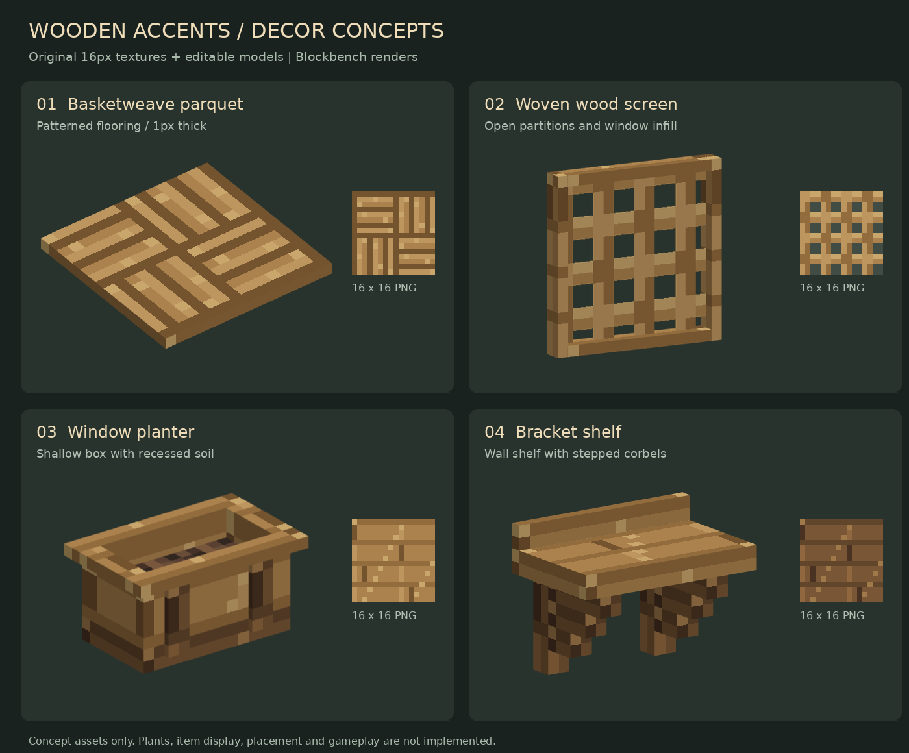

# Wooden decor concepts

Four oak concept assets for visual review. These are Blockbench previews, not in-game screenshots. No blocks, recipes, interactions, or wood variants have been registered.

| Concept | Intended use | Files |
| --- | --- | --- |
| Basketweave parquet | A patterned alternative to plank flooring; one pixel thick | [Model](parquet.bbmodel), [export](parquet.json), [preview](parquet-preview.png) |
| Woven wood screen | Open partitions, window infill, or trellises | [Model](screen.bbmodel), [export](screen.json), [preview](screen-preview.png) |
| Window planter | A shallow soil-filled box for exterior windows and balconies | [Model](planter.bbmodel), [export](planter.json), [preview](planter-preview.png) |
| Bracket shelf | A small wall shelf with stepped wooden corbels | [Model](shelf.bbmodel), [export](shelf.json), [preview](shelf-preview.png) |

The planter and shelf would be my first picks. They add useful silhouettes beside the existing furniture without needing large builds.

## Asset notes

All five PNG textures are original 16 by 16 pixel art. Texture references use the `wooden_accents_concepts` namespace and resolve under the included assets directory. The Blockbench projects embed textures for portable editing. The JSON exports use cuboids and ordinary per-face UVs.

The screen's middle is a two-sided, zero-thickness textured plane. Integration requires cutout rendering. The planter includes soil but no plants or planting behavior. Shelf item display and planter flower support are possible follow-up features, not part of these assets. Placement, collision shapes, recipes, loot, and variants still need implementation if selected.

The Blockbench projects embed their textures for portable editing. The JSON exports are reference
models only and are not consumed by the mod build.
